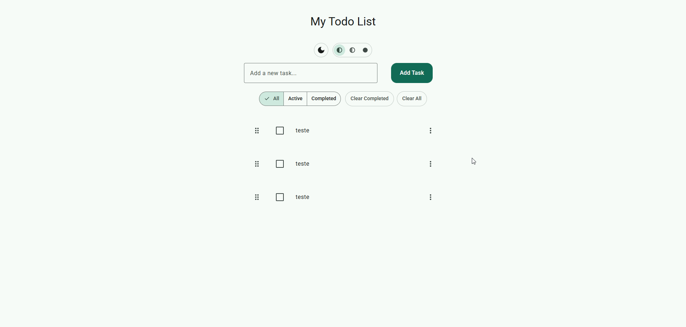
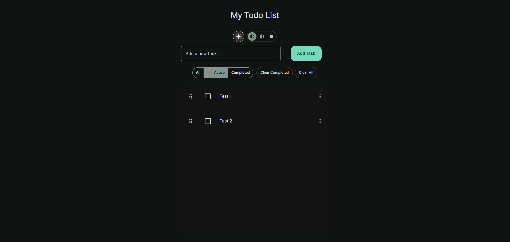

# Aplicativo de Lista de Tarefas

Um aplicativo web moderno de lista de tarefas construído com **HTML, CSS e JavaScript vanilla** - apresentando Material Design 3, reordenação por arrastar e soltar, edição de tarefas, alternância de tema e persistência completa com `localStorage`.

**Demonstração ao Vivo:** [https://herissonneves.github.io/axio/](https://herissonneves.github.io/axio/)

## 📦 Versão atual

**v1.1.0** — lançamento estável. Esta versão inclui: recursos principais (adicionar / marcar como concluída / remover tarefas), reordenação por arrastar e soltar, edição de tarefas com diálogos de confirmação, alternância de tema (claro/escuro), níveis de contraste, persistência (localStorage), filtros (todas / ativas / concluídas), limpar concluídas/todas, layout responsivo e interface compatível com Material Design 3.

> 📋 Para changelog detalhado, consulte [CHANGELOG.md](CHANGELOG.md)

## Demonstração






## 🚀 Funcionalidades

### Gerenciamento de Tarefas
- ✅ Adicionar uma nova tarefa
- ✅ Marcar tarefas como concluídas (alternar)
- ✅ Editar tarefas existentes via menu suspenso
- ✅ Remover tarefas com diálogo de confirmação
- ✅ Arrastar e soltar para reordenar tarefas
- ✅ Tarefas são persistidas no armazenamento do navegador (`localStorage`)
- ✅ Filtrar tarefas: **Todas / Ativas / Concluídas**
- ✅ Limpar todas as tarefas concluídas
- ✅ Limpar todas as tarefas

### Design e Temas
- ✅ Interface compatível com Material Design 3
- ✅ Alternância entre tema claro e escuro
- ✅ Múltiplos níveis de contraste (Padrão / Médio / Alto)
- ✅ Animações e transições suaves
- ✅ Layout responsivo
- ✅ Suporte a dispositivos touch

### Experiência do Usuário
- ✅ Diálogos de confirmação para ações destrutivas
- ✅ Feedback visual para operações de arrastar e soltar
- ✅ Suporte a navegação por teclado (Escape para fechar diálogos)
- ✅ Acessível com atributos ARIA
- ✅ Suporte a preferência de movimento reduzido

## 📂 Estrutura do Projeto

```
/
├── index.html
├── css/
│   ├── main.css              # Orquestrador principal de estilos
│   ├── base.css              # Estilos base e resets
│   ├── layout.css            # Estilos de layout e grid
│   ├── components.css        # Estilos de componentes
│   ├── utilities.css         # Classes utilitárias
│   └── themes/              # Definições de temas
│       ├── theme-light.css
│       ├── theme-light-mc.css
│       ├── theme-light-hc.css
│       ├── theme-dark.css
│       ├── theme-dark-mc.css
│       └── theme-dark-hc.css
├── js/
│   ├── main.js               # Ponto de entrada da aplicação
│   └── modules/
│       ├── storage.js        # Utilitários de localStorage
│       ├── todo.js           # Lógica de gerenciamento de tarefas
│       └── ui.js             # Renderização e componentes de UI
├── demo/                     # GIFs de demonstração
└── README.md
```

## 💻 Primeiros Passos - Como Executar Localmente

1. Clone o repositório

    ```bash
    git clone https://github.com/herissonneves/axio.git
    cd axio
    ```

2. Abra `index.html` no seu navegador (duplo clique ou use VSCode Live Server / qualquer servidor estático)

3. Comece a adicionar tarefas - o aplicativo funciona no navegador sem qualquer backend ou ferramentas de build

## 🧠 Como Usar

### Operações Básicas
- Use o campo de entrada no topo para digitar uma nova tarefa e pressione "**Adicionar Tarefa**" para criá-la.
- Clique no texto ou na caixa de seleção de uma tarefa para marcá-la como concluída (ou alternar de volta para ativa).
- Use o **menu de três pontos** (⋮) ao lado de uma tarefa para acessar opções:
  - **Editar**: Abre um diálogo para editar o texto da tarefa
  - **Excluir**: Abre um diálogo de confirmação antes de remover a tarefa
- Use os botões de filtro (Todas / Ativas / Concluídas) para visualizar apenas tarefas do status selecionado.
- Use "**Limpar Concluídas**" para remover todas as tarefas concluídas de uma vez.
- Use "**Limpar Todas**" para remover todas as tarefas.

### Arrastar e Soltar
- Clique e segure o **botão de arrastar** (ícone de seis pontos) à esquerda de qualquer tarefa
- Arraste a tarefa para uma nova posição na lista
- Solte para posicionar a tarefa na nova posição
- A nova ordem é salva automaticamente

### Tema e Contraste
- Clique no **ícone de sol/lua** para alternar entre temas claro e escuro
- Use os botões do **seletor de contraste** para escolher o nível de contraste:
  - **Padrão**: Contraste padrão
  - **Médio**: Contraste médio
  - **Alto**: Contraste alto
- Suas preferências de tema e contraste são salvas automaticamente

### Atalhos de Teclado
- **Escape**: Fechar qualquer diálogo aberto
- **Enter**: Enviar formulários (adicionar tarefa, editar tarefa)

## 🎨 Sistema de Design

Esta aplicação segue as diretrizes do **Material Design 3**:

- **Sistema de Cores**: Usa tokens de cores do Material Design 3
- **Tipografia**: Família de fontes Roboto com escala de tipos do Material Design
- **Componentes**: Componentes compatíveis com Material Design 3 (botões, diálogos, menus)
- **Elevação**: Sistema de sombras adequado para superfícies elevadas
- **Camadas de Estado**: Elementos interativos usam camadas de estado para feedback
- **Animações**: Transições suaves seguindo os princípios de movimento do Material Design

## ♿ Acessibilidade

- **Atributos ARIA**: Todos os elementos interativos têm rótulos e funções ARIA adequados
- **Navegação por Teclado**: Suporte completo ao teclado para todas as funcionalidades
- **Gerenciamento de Foco**: Tratamento adequado de foco em diálogos e menus
- **Movimento Reduzido**: Respeita a consulta de mídia `prefers-reduced-motion`
- **Leitores de Tela**: HTML semântico e atributos ARIA para suporte a leitores de tela
- **Alto Contraste**: Suporte para temas de alto contraste

## ⚙️ Detalhes de Implementação

### Stack Técnico
- **JavaScript Vanilla** (módulos ES6) - Sem ferramentas de build, sem dependências
- **CSS Moderno** com propriedades personalizadas (variáveis CSS)
- **HTML5** marcação semântica
- **localStorage** para persistência de dados

### Estrutura de Dados
- Os dados são armazenados no `localStorage` como um array de objetos serializado em JSON.
- Cada objeto de tarefa contém:
    ```js
    {
        id: string,        // UUID único (ou fallback de timestamp)
        text: string,      // descrição da tarefa
        completed: boolean // status de conclusão
    }
    ```

### Arquitetura
- **Estrutura Modular**: Código organizado em módulos (storage, todo, ui)
- **Separação de Responsabilidades**: UI, lógica e armazenamento de dados são separados
- **Orientado a Eventos**: Usa eventos DOM para interações do usuário
- **Gerenciamento de Estado**: Estado centralizado de tarefas com persistência em localStorage

### Implementação de Funcionalidades
- **Arrastar e Soltar**: Usa API HTML5 Drag and Drop com feedback visual personalizado
- **Diálogos**: Componentes de diálogo personalizados com sobreposição e desfoque de fundo
- **Menu**: Componente de menu suspenso com posicionamento adequado
- **Sistema de Temas**: Propriedades CSS personalizadas com atributos de dados para alternância de temas
- **Persistência**: Salvamento automático em qualquer modificação de tarefa

## 🌐 Suporte a Navegadores

- **Navegadores Modernos**: Chrome, Firefox, Safari, Edge (versões mais recentes)
- **Módulos ES6**: Requer suporte do navegador para módulos ES6
- **localStorage**: Requer suporte do navegador para API localStorage
- **API Drag and Drop**: Requer suporte do navegador para HTML5 Drag and Drop

## 🧪 Melhorias Futuras

- [ ] Adicionar testes unitários
- [ ] Adicionar testes de integração
- [ ] Adicionar documentação de atalhos de teclado
- [ ] Adicionar mais GIFs de demonstração
- [ ] Implementar categorias/tags de tarefas
- [ ] Adicionar datas de vencimento de tarefas
- [ ] Adicionar prioridades de tarefas
- [ ] Opcionalmente: persistir tarefas por usuário (backend e banco de dados)
- [ ] Melhorias para dispositivos móveis (ex.: gestos de deslizar)
- [ ] Exportar/importar tarefas (JSON)
- [ ] Funcionalidade de busca de tarefas

## 🤝 Contribuindo

Contribuições são bem-vindas! Sinta-se à vontade para enviar um Pull Request.

1. Faça um fork do repositório
2. Crie sua branch de funcionalidade (`git checkout -b feature/AmazingFeature`)
3. Faça commit de suas alterações (`git commit -m 'Adiciona alguma AmazingFeature'`)
4. Envie para a branch (`git push origin feature/AmazingFeature`)
5. Abra um Pull Request

Certifique-se de seguir o estilo de código existente e adicionar documentação apropriada.

## 📝 Sobre

Este projeto foi criado como um exercício prático em JavaScript, HTML e CSS vanilla - para aprender manipulação de DOM, `localStorage`, renderização dinâmica, gerenciamento de estado e implementação do Material Design 3.

A aplicação demonstra:
- JavaScript moderno (módulos ES6)
- Propriedades CSS personalizadas e temas
- Arquitetura baseada em componentes
- Melhores práticas de acessibilidade
- Diretrizes do Material Design 3

Sinta-se à vontade para fazer fork, experimentar e estender como desejar. Pull requests e sugestões são bem-vindos.

## 📋 Changelog

Consulte [CHANGELOG.md](CHANGELOG.md) para uma lista detalhada de alterações e histórico de versões.

## 📄 Licença

Este projeto é open source e está disponível sob a [Licença MIT](LICENSE).

---

**Feito com 💪 usando JavaScript vanilla**
