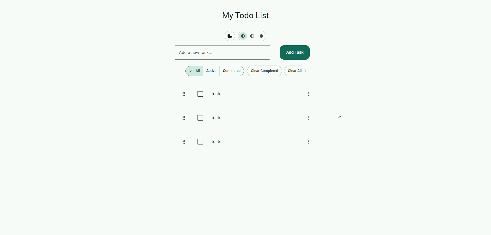
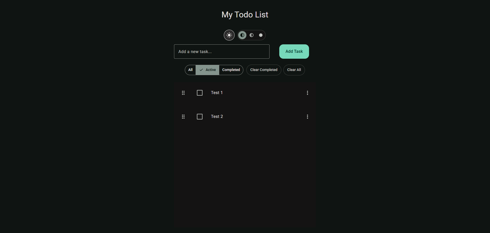

# Todo List App

A modern todo list web app built with **HTML, CSS, and vanilla JavaScript** — featuring Material Design 3, drag-and-drop reordering, task editing, theme switching, and full persistence with `localStorage`.

**Live Demo:** [https://herissonneves.github.io/axio/](https://herissonneves.github.io/axio/)

## 📦 Current version

**v1.3.0** — Highly Modular Architecture. This release includes: all v1.2.0 features + full modularization of `main.js`, `ui.js`, `i18n.js`, and `keyboard.js`, removal of unnecessary wrappers (114 lines removed), expanded tests (+41 new tests, 128+ total), critical bug fixes, and an architecture optimized for maximum maintainability, testability, and structural clarity.

> 📋 For a detailed changelog, see [CHANGELOG.md](CHANGELOG.md)

## Demo






## 🚀 Features

### Task management

- ✅ Add a new task
- ✅ Mark tasks as completed (toggle)
- ✅ Edit existing tasks via dropdown menu
- ✅ Remove tasks with confirmation dialog
- ✅ Drag and drop to reorder tasks
- ✅ Tasks are persisted in browser storage (`localStorage`)
- ✅ Filter tasks: **All / Active / Completed**
- ✅ Clear all completed tasks
- ✅ Clear all tasks

### Design and themes

- ✅ Material Design 3–compatible interface
- ✅ Light and dark theme toggle
- ✅ Multiple contrast levels (Default / Medium / High)
- ✅ Smooth animations and transitions
- ✅ Responsive layout
- ✅ Touch device support

### User experience

- ✅ Confirmation dialogs for destructive actions
- ✅ Visual feedback for drag-and-drop operations
- ✅ Keyboard navigation support (Escape to close dialogs)
- ✅ Accessible with ARIA attributes
- ✅ Reduced motion preference support

## 📂 Project structure

```plaintext
/
├── index.html
├── css/
│   ├── main.css              # Main style orchestrator
│   ├── base.css              # Base styles and resets
│   ├── layout.css            # Layout and grid styles
│   ├── components.css        # Component orchestrator
│   ├── components/           # Specialized CSS components
│   │   ├── header.css
│   │   ├── language-selector.css
│   │   ├── theme-controls.css
│   │   ├── form.css
│   │   ├── todo-item.css
│   │   ├── filters.css
│   │   ├── clear-buttons.css
│   │   ├── drag-drop.css
│   │   ├── menu.css
│   │   ├── dialog.css
│   │   └── README.md
│   ├── utilities.css         # Utility classes
│   └── themes/               # Theme definitions
│       ├── theme-light.css
│       ├── theme-light-mc.css
│       ├── theme-light-hc.css
│       ├── theme-dark.css
│       ├── theme-dark-mc.css
│       └── theme-dark-hc.css
├── js/
│   ├── main.js               # Main application orchestrator (254 lines)
│   └── modules/
│       ├── storage.js        # localStorage utilities
│       ├── todo.js           # Task management logic
│       ├── app/              # Main application modules
│       │   ├── index.js      # Centralized exports
│       │   ├── app-config.js # Application configuration
│       │   ├── app-theme.js  # Theme/contrast management
│       │   ├── app-filters.js # Filter management
│       │   └── app-i18n.js   # Language/translation management
│       ├── i18n/             # Internationalization modules
│       │   ├── index.js
│       │   ├── i18n-config.js
│       │   ├── i18n-core.js
│       │   ├── i18n-detector.js
│       │   ├── i18n-storage.js
│       │   ├── i18n-translations.js
│       │   ├── i18n-utils.js
│       │   └── README.md
│       ├── keyboard/         # Keyboard shortcut modules
│       │   ├── index.js
│       │   ├── keyboard-config.js
│       │   ├── keyboard-dialog.js
│       │   ├── keyboard-dom.js
│       │   ├── keyboard-shortcuts.js
│       │   ├── keyboard-utils.js
│       │   └── README.md
│       └── ui/               # User interface modules
│           ├── index.js
│           ├── ui-icons.js
│           ├── ui-elements.js
│           ├── ui-menu.js
│           ├── ui-dialogs.js
│           ├── ui-drag.js
│           ├── ui-render.js
│           └── README.md
├── tests/                    # Unit and integration tests (128+ tests)
│   ├── index.html            # Web UI to run tests
│   ├── test-runner.js        # Custom test framework
│   ├── test-runner-ui.js     # Test runner UI logic
│   ├── test-runner-ui.css    # Test runner UI styles
│   ├── unit/                 # Unit tests per module
│   │   ├── storage.test.js
│   │   ├── todo.test.js
│   │   ├── i18n.test.js
│   │   ├── keyboard.test.js
│   │   ├── app.test.js
│   │   └── ui.test.js
│   ├── integration/          # Integration tests
│   │   └── integration.test.js
│   └── README.md
├── demo/                     # Demo GIFs and screenshots
├── CHANGELOG.md
├── CONTRIBUTING.md
└── README.md
```

## 💻 Getting started — run locally

1. Clone the repository

   ```bash
   git clone https://github.com/herissonneves/axio.git
   cd axio
   ```

2. Open `index.html` in your browser (double-click or use VS Code Live Server / any static server)

3. Start adding tasks — the app runs entirely in the browser with no backend or build tools

## 🧠 How to use

### Basic operations

- Use the input field at the top to type a new task and press **"Add Task"** to create it.
- Click a task’s text or checkbox to mark it as completed (or toggle back to active).
- Use the **three-dot menu** (⋮) next to a task to access options:
  - **Edit**: Opens a dialog to edit the task text
  - **Delete**: Opens a confirmation dialog before removing the task
- Use the filter buttons (All / Active / Completed) to view only tasks with the selected status.
- Use **"Clear Completed"** to remove all completed tasks at once.
- Use **"Clear All"** to remove all tasks.

### Drag and drop

- Click and hold the **drag handle** (six-dot icon) to the left of any task
- Drag the task to a new position in the list
- Release to place the task in the new position
- The new order is saved automatically

### Theme and contrast

- Click the **sun/moon icon** to toggle between light and dark themes
- Use the **contrast selector** buttons to choose the contrast level:
  - **Default**: Standard contrast
  - **Medium**: Medium contrast
  - **High**: High contrast
- Your theme and contrast preferences are saved automatically

### Keyboard shortcuts

The app supports several keyboard shortcuts for easier use:

#### Navigation and focus

- **Ctrl+K** or **/** — Focus the task input field
- **Ctrl+?** or **F1** — Show help dialog with all shortcuts

#### Filters

- **1** — Show all tasks
- **2** — Show active tasks only
- **3** — Show completed tasks only

#### Quick actions

- **Ctrl+G** — Toggle light and dark theme
- **Ctrl+J** — Cycle contrast level (default → medium → high → default)
- **Ctrl+L** — Toggle language (Portuguese ↔ English)
- **Ctrl+Delete** — Clear all completed tasks
- **Ctrl+Shift+Delete** — Clear all tasks

#### Dialogs

- **Escape** — Close any open dialog
- **Enter** — Submit forms (add task, edit task)

> 💡 **Tip**: Press **Ctrl+?** or **F1** at any time to see all available shortcuts!

**Note**: On macOS, use **Cmd** instead of **Ctrl**.

## 🎨 Design system

This app follows **Material Design 3** guidelines:

- **Color system**: Uses Material Design 3 color tokens
- **Typography**: Roboto font family with Material Design type scale
- **Components**: Material Design 3–compatible components (buttons, dialogs, menus)
- **Elevation**: Proper shadow system for elevated surfaces
- **State layers**: Interactive elements use state layers for feedback
- **Animations**: Smooth transitions following Material Design motion principles

## ♿ Accessibility

- **ARIA attributes**: All interactive elements have proper ARIA labels and roles
- **Keyboard navigation**: Full keyboard support for all features
- **Focus management**: Proper focus handling in dialogs and menus
- **Reduced motion**: Respects the `prefers-reduced-motion` media query
- **Screen readers**: Semantic HTML and ARIA attributes for screen reader support
- **High contrast**: Support for high-contrast themes

## ⚙️ Implementation details

### Tech stack

- **Vanilla JavaScript** (ES6 modules) — No build tools, no dependencies
- **Modern CSS** with custom properties (CSS variables)
- **HTML5** semantic markup
- **localStorage** for data persistence

### Data structure

- Data is stored in `localStorage` as a JSON-serialized array of objects.
- Each task object contains:

  ```js
  {
      id: string,        // unique UUID (or timestamp fallback)
      text: string,      // task description
      completed: boolean // completion status
  }
  ```

### Architecture

- **Highly modular structure**: Code organized into 28 specialized modules
  - `app/`: Main application modules (5 files: config, theme, filters, i18n)
  - `i18n/`: Internationalization system (7 specialized modules)
  - `keyboard/`: Keyboard shortcut system (6 specialized modules)
  - `ui/`: Interface components (7 specialized modules)
  - `css/components/`: Modularized styles (10 specialized CSS files)
- **Separation of concerns**: UI, logic, storage, and configuration are separated
- **Event-driven**: Uses DOM events for user interactions
- **State management**: Centralized state with localStorage persistence
- **High testability**: 128+ unit and integration tests (~95% coverage)
- **Design patterns**: Module, Factory, Strategy, Observer, Dependency Injection, Pure Functions
- **SOLID principles**: Applied rigorously across all modules

### Feature implementation

- **Drag and drop**: HTML5 Drag and Drop API with custom visual feedback
- **Dialogs**: Custom dialog components with overlay and background blur
- **Menu**: Dropdown menu component with proper positioning
- **Theme system**: CSS custom properties with data attributes for theme switching
- **Persistence**: Automatic save on any task modification

## 🌐 Browser support

- **Modern browsers**: Chrome, Firefox, Safari, Edge (latest versions)
- **ES6 modules**: Requires browser support for ES6 modules
- **localStorage**: Requires browser support for the localStorage API
- **Drag and Drop API**: Requires browser support for HTML5 Drag and Drop

## 🧪 Future improvements

- [x] Add unit tests ✅ (v1.3.0 — 128+ tests implemented)
- [x] Add integration tests ✅ (v1.3.0)
- [x] Add keyboard shortcut documentation ✅ (v1.2.0)
- [x] Modularize entire project structure ✅ (v1.3.0 — 28 specialized modules)
- [x] Implement theme system with multiple contrast levels ✅ (v1.1.0)
- [x] Add internationalization (PT/EN) ✅ (v1.2.0)
- [ ] Add more demo GIFs
- [ ] Implement task categories/tags
- [ ] Add task due dates
- [ ] Add task priorities
- [ ] Optionally: persist tasks per user (backend and database)
- [ ] Mobile improvements (e.g. swipe gestures)
- [ ] Export/import tasks (JSON)
- [ ] Task search functionality

## 🤝 Contributing

Contributions are welcome! Feel free to open a Pull Request.

1. Fork the repository
2. Create your feature branch (`git checkout -b feature/AmazingFeature`)
3. Commit your changes (`git commit -m 'Add some AmazingFeature'`)
4. Push to the branch (`git push origin feature/AmazingFeature`)
5. Open a Pull Request

Please follow the existing code style and add appropriate documentation.

## 📝 About

This project was created as a hands-on exercise in vanilla JavaScript, HTML, and CSS — to learn DOM manipulation, `localStorage`, dynamic rendering, state management, and Material Design 3 implementation.

The app demonstrates:

- Modern JavaScript (ES6 modules)
- Highly modular architecture (28 specialized modules)
- CSS custom properties and themes
- Component-based architecture
- Accessibility best practices
- Material Design 3 guidelines
- Unit and integration tests (128+ tests, ~95% coverage)
- Design patterns (Module, Factory, Strategy, Observer, Dependency Injection)
- SOLID principles applied rigorously
- Complete documentation with JSDoc

Feel free to fork, experiment, and extend as you like. Pull requests and suggestions are welcome.

## 📋 Changelog

See [CHANGELOG.md](CHANGELOG.md) for a detailed list of changes and version history.

## 📄 License

This project is open source and available under the [MIT License](LICENSE).

---

Made with 💪 using vanilla JavaScript
