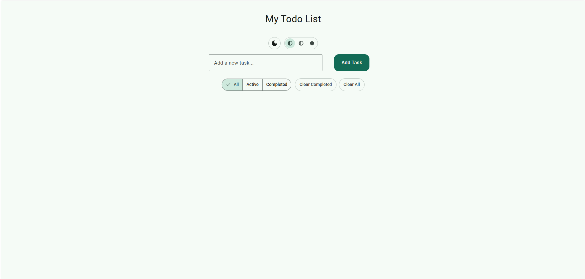
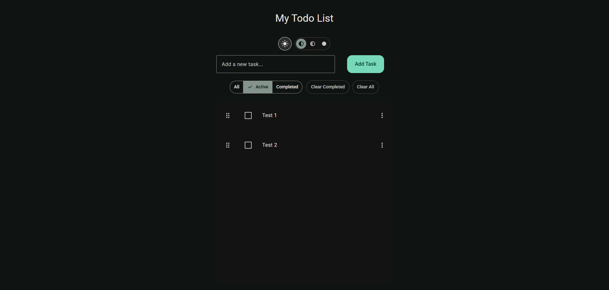

# Axio

A local-first task manager built with **HTML, CSS, and vanilla JavaScript** — featuring Material Design 3, drag-and-drop reordering, task editing, theme switching, and full persistence with `localStorage`.

**Live Demo:** [https://herissonneves.github.io/axio/](https://herissonneves.github.io/axio/)

## 📦 Latest tagged release

**v1.3.0** is the latest published release.

The `main` branch may contain changes planned for the next release.
See [CHANGELOG.md](CHANGELOG.md) for details.

## 🧭 Architecture decisions

- [ADR 0001 — Product direction: Vanilla v1.4 → Next.js v2](docs/adr/0001-direcao-do-produto.md)

## 🎬 Demo





## 🚀 Features

### Task management

- Add a new task
- Mark tasks as completed (toggle)
- Edit existing tasks via dropdown menu
- Remove tasks with confirmation dialog
- Drag and drop to reorder tasks
- Tasks are persisted in browser storage (`localStorage`)
- Filter tasks: **All / Active / Completed**
- Clear all completed tasks
- Clear all tasks

### Design and themes

- Material Design 3–compatible interface
- Light and dark theme toggle
- Smooth animations and transitions
- Responsive layout
- Touch device support

### User experience

- Confirmation dialog when deleting an individual task
- Visual feedback for drag-and-drop operations
- Keyboard navigation support (Escape to close dialogs)
- Semantic HTML and selected ARIA attributes; known accessibility gaps are listed below
- Reduced motion preference support

## 📂 Project structure

```text
.
├── index.html              # Application entry page
├── css/                    # Design tokens, layouts, themes, and components
├── js/
│   ├── main.js             # Application entry point
│   └── modules/
│       ├── app/            # Application initialization and configuration
│       ├── i18n/           # Internationalization
│       ├── keyboard/       # Keyboard shortcuts
│       ├── ui/             # Rendering and user interaction
│       ├── storage.js      # Browser persistence
│       └── todo.js         # Task domain logic
├── tests/                  # Browser-based unit and integration tests
├── docs/adr/               # Architecture Decision Records
├── CHANGELOG.md
├── CONTRIBUTING.md
└── README.md
```

## 💻 Getting started — run locally

1. Clone the repository

   ```bash
   git clone https://github.com/herissonneves/axio.git
   cd axio
   ```

2. The project uses native ES modules and must be served over HTTP. From the project root, run:

   ```bash
   python3 -m http.server 8000
   ```

3. Open the application at: http://localhost:8000/

4. No dependency installation or build step is required for the Vanilla JavaScript application.

5. Start adding tasks — the app runs entirely in the browser with no backend or build tools

## 🧠 How to use

### Basic operations

- Use the input field at the top to type a new task and press **"Add Task"** to create it.
- Click a task’s text or checkbox to mark it as completed (or toggle back to active).
- Use the **three-dot menu** (⋮) next to a task to access options:
  - **Edit**: Opens a dialog to edit the task text
  - **Delete**: Opens a confirmation dialog before removing the task
- Use the filter buttons (All / Active / Completed) to view only tasks with the selected status.
- Use **"Clear Completed"** to remove all completed tasks at once.
- Use **"Clear All"** to remove all tasks.

### Drag and drop

- Click and hold the **drag handle** (six-dot icon) to the left of any task
- Drag the task to a new position in the list
- Release to place the task in the new position
- The new order is saved automatically

### Theme

- Click the **sun/moon icon** to toggle between light and dark themes
- Your theme preference is saved automatically

### Keyboard shortcuts

The app supports several keyboard shortcuts for easier use:

#### Navigation and focus

- **Ctrl+K** — Focus the task input field
- **/** — Focus the task input field when focus is outside an editable field

> Known issue: the `/` shortcut currently interferes with typing `/` inside
> editable fields. A fix is planned for v1.4.

- **Ctrl+?** or **F1** — Show help dialog with all shortcuts

#### Filters

- **1** — Show all tasks
- **2** — Show active tasks only
- **3** — Show completed tasks only

#### Quick actions

- **Ctrl+G** — Toggle light and dark theme
- **Ctrl+L** — Toggle language (Portuguese ↔ English)
- **Ctrl+Delete** — Clear all completed tasks
- **Ctrl+Shift+Delete** — Clear all tasks

#### Dialogs

- **Escape** — Close any open dialog
- **Enter** — Submit forms (add task, edit task)

> 💡 **Tip**: Press **Ctrl+?** or **F1** at any time to see all available shortcuts!

**Note**: On macOS, use **Cmd** instead of **Ctrl**.

## 🎨 Design system

This app follows **Material Design 3** guidelines:

- **Color system**: Uses Material Design 3 color tokens
- **Typography**: Roboto font family with Material Design type scale
- **Components**: Material Design 3–compatible components (buttons, dialogs, menus)
- **Elevation**: Proper shadow system for elevated surfaces
- **State layers**: Interactive elements use state layers for feedback
- **Animations**: Smooth transitions following Material Design motion principles

## ♿ Accessibility

The project currently includes:

- semantic HTML and selected ARIA attributes
- visible focus styles
- reduced-motion support
- keyboard shortcuts for common actions
- Escape handling for selected dialogs

Known accessibility gaps:

- menus do not yet implement complete arrow-key navigation
- dialogs do not yet provide complete focus trapping and focus restoration
- drag-and-drop reordering does not have a keyboard alternative
- the `/` shortcut currently conflicts with typing inside editable fields

These limitations are tracked as part of the v1.4 stabilization work.

## ⚙️ Implementation details

### Tech stack

- **Vanilla JavaScript** (ES6 modules) — No build tools, no dependencies
- **Modern CSS** with custom properties (CSS variables)
- **HTML5** semantic markup
- **localStorage** for data persistence

### Data structure

- Data is stored in `localStorage` as a JSON-serialized array of objects.
- Each task object contains:

  ```js
  {
      id: string,        // unique UUID (or timestamp fallback)
      text: string,      // task description
      completed: boolean // completion status
  }
  ```

### Architecture

The application uses native ES modules and separates its main concerns into:

- task domain logic
- browser persistence
- rendering and DOM interaction
- keyboard shortcuts
- internationalization
- application initialization

The project currently has no runtime dependencies or build step.

Some areas remain more fragmented than necessary. Simplifying module boundaries
and consolidating application initialization are planned for v1.4.

### Feature implementation

- **Drag and drop**: HTML5 Drag and Drop API with custom visual feedback
- **Dialogs**: Custom dialog components with overlay and background blur
- **Menu**: Dropdown menu component with proper positioning
- **Theme system**: CSS custom properties with data attributes for theme switching
- **Persistence**: Automatic save on any task modification

## 🌐 Browser support

- **Modern browsers**: Chrome, Firefox, Safari, Edge (latest versions)
- **ES6 modules**: Requires browser support for ES6 modules
- **localStorage**: Requires browser support for the localStorage API
- **Drag and Drop API**: Requires browser support for HTML5 Drag and Drop

## 🧪 Testing

The project includes a custom browser-based test runner with unit and
integration tests. The current runner executes 110 tests. Additional test
modules exist but are not yet registered in the runner.

Automated code coverage is not currently configured.

Start a local server from the project root:

```bash
python3 -m http.server 8000
```

Then open:
- Application: http://localhost:8000/
- Test runner: http://localhost:8000/tests/

## 🛣️ Roadmap

### Completed foundations

- [x] Light and dark themes
- [x] Portuguese and English internationalization
- [x] Keyboard shortcut documentation
- [x] Native ES module organization
- [x] Browser-based unit and integration tests

### Planned for v1.4

- [ ] Register every existing test module in the test runner
- [ ] Add reproducible code coverage reporting
- [ ] Fix keyboard shortcut conflicts in editable fields
- [ ] Improve menu and dialog keyboard navigation
- [ ] Add a keyboard-accessible alternative to drag-and-drop
- [ ] Complete categories and tags
  - Domain logic and persistence are partially implemented.
  - User interface support is still pending.
- [ ] Add task search
- [ ] Add JSON import and export
- [ ] Add task priorities and due dates
- [ ] Add a high-contrast mode and `forced-colors` support

### Possible future work

- [ ] Add more demo GIFs
- [ ] Explore mobile gestures
- [ ] Evaluate optional account-based synchronization

## 🤝 Contributing

Contributions are welcome! Feel free to open a Pull Request.

1. Fork the repository
2. Create your feature branch (`git checkout -b feature/AmazingFeature`)
3. Commit your changes (`git commit -m 'Add some AmazingFeature'`)
4. Push to the branch (`git push origin feature/AmazingFeature`)
5. Open a Pull Request

Please follow the existing code style and add appropriate documentation.

## 📝 About

This project was created as a hands-on exercise in vanilla JavaScript, HTML, and CSS — to learn DOM manipulation, `localStorage`, dynamic rendering, state management, and Material Design 3 implementation.

The project demonstrates:

- native JavaScript modules without runtime dependencies
- task state and persistence with `localStorage`
- dynamic DOM rendering and event handling
- Portuguese and English internationalization
- light and dark themes using CSS custom properties
- keyboard shortcuts for common actions
- browser-based unit and integration tests
- explicit documentation of architectural decisions
- incremental accessibility improvements and known limitations

Feel free to fork, experiment, and extend as you like. Pull requests and suggestions are welcome.

## 📋 Changelog

See [CHANGELOG.md](CHANGELOG.md) for a detailed list of changes and version history.

## 📄 License

This project is open source and available under the [MIT License](LICENSE).

---

Made with 💪 using vanilla JavaScript
